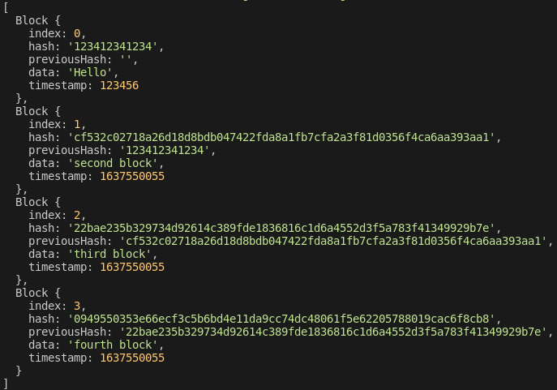

# typechain

blockchain with TypeScript.
타입스크립트를 입문해보고 연습하기 위한 프로젝트.

# 목차

- [결과물](#결과물)
- [파일 구성](#파일-구성)
  - [package.json](#package.json)
  - [tsconfig.json](#tsconfig.json)
- [패키지](#패키지)
  - [typescript](#typescript)
  - [tsc-watch](#tsc-watch)
  - [crypto-js](#crypto-js)
- [TypeScript 문법](#TypeScript-문법)
  - [interface](#interface)
  - [class](#class)
  - [static](#static)

## 결과물

```js
const genesisBlock: Block = new Block(0, "2020202020202", "", "Hello", 123456);
createNewBlock("second block");
createNewBlock("third block");
createNewBlock("fourth block");
console.log(blockchain);
```



## 파일 구성

```bash
├── img
│   └── output.png
├── src
│   └── index.ts
├── .gitignore
├── package-lock.json
├── package.json
├── README.md
└── tsconfig.json
```

### package.json

- [tsc-watch](https://www.npmjs.com/package/tsc-watch)패키지를 통해 TypeScript파일이 저장될 때 마다 Success되면 컴파일을 한 후, 해당 파일을 실행하는 스크립트를 작성.

```json
"scripts": {
    "start": "tsc-watch --onSuccess \" node dist/index.js\" "
  },
```

### tsconfig.json

TypeScript에서 JavaScript로 변환하면서 필요한 옵션을 부여하기위한 파일

```json
{
  "compilerOptions": {
    "module": "commonjs", //commonjs node.js를 사용하고, import나 export를 사용할 수 있게 만들어줌.
    "target": "ES2015", // 어떤 버전의 JavaScript로 컴파일 되고싶은지 작성
    "sourceMap": true, // .map.js 파일도 함께 생성할지를 결정
    "outDir": "dist" // 컴파일 한 결과물이 들어갈 폴더명을 작성
  },
  "include": ["src/index.ts"], // 컴파일 과정에서 포함될 파일/폴더
  "exclude": ["node_modules"] // 컴파일 과정에서 포함하지 않을 파일/폴더
}
```

## 패키지

### [typescript](https://www.npmjs.com/package/typescript)

> npm install -g typescript

- index.ts 파일의 코드들을 컴파일하여 index.js와 index.js.map을 만들어줌.
- 코드를 작성할 때 변수의 타입, 어떤 타입을 반환하는지를 설정해주어야함.

### [tsc-watch](https://www.npmjs.com/package/tsc-watch)

> npm install --save-dev tsc-watch

- TypeScript 파일(.ts)이 저장될 때 마다, Success 되면 컴파일을 해주는 패키지

### [crypto-js](https://www.npmjs.com/package/crypto-js)

> npm install crypto-js

- JavaScript에서 해시 함수를 통한 암호화를 할 수 있도록 해주는 패키지

## TypeScript 문법

### interface

- Object에 타입을 명시
- 특정 Object에 type을 할당해줄 때 사용. 코드를 작성할 때 에러를 발생시킬 확률을 낮출 수 있음
- JavaScript로 컴파일이 되지 않음

```ts
interface Human {
  name: string;
  age: number;
  gender: string;
}

const sayHi = (person: Human): string => {
  return `hi, im ${person.name}. i am ${person.age} years old. i am ${person.gender}`;
};
```

### class

- [interface](#interface)와 비슷하게 사용할 수 있지만, JavaScript로 컴파일이 된다는 차이점이 있음
  - 코드를 컨드롤 할 수 있게 해줌
  - TypeScript 측면에서 봤을 때는 [interface](#interface)가 더 안전하지만, react, nodejs, expressjs등을 사용하게 된다면 코드를 컨트롤 해야할 상황이 생길 수 있기 때문에 class를 사용해야 함
- JavaScript의 class와는 다르게, 속성들을 표시해주어야한다.
  - 해당 속성들이 가지고있는 권한들도 표시해주어야함.
    - ex) public, private

```ts
class Block {
  public index: number;
  public hash: string;
  public previousHash: string;
  public data: string;
  public timestamp: number;

  constructor(
    index: number,
    hash: string,
    previousHash: string,
    data: string,
    timestamp: number
  ) {
    this.index = index;
    this.hash = hash;
    this.previousHash = previousHash;
    this.data = data;
    this.timestamp = timestamp;
  }
}
```

## static

- class 내에서 method 앞에 static을 써주면, 해당 class의 타입이 아닌 외부에서도 method를 사용할 수 있다.

```ts
class Block {
  static calculateBlockHash = (
    index: number,
    previousHash: string,
    timestamp: number,
    data: string
  ): string =>
    CryptoJS.SHA256(index + previousHash + timestamp + data).toString();
}

const newHash: string = Block.calculateBlockHash(
  newIndex,
  previousBlock.hash,
  newTimestamp,
  data
);
```
